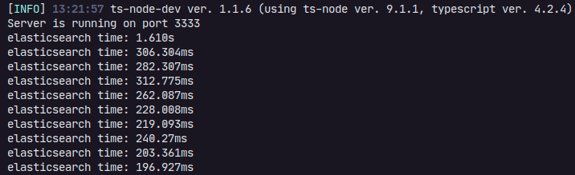
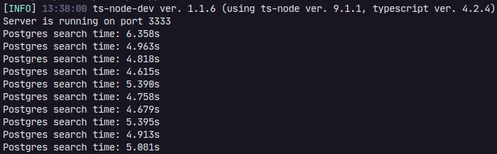

<h1 align=center>Elasticsearch vs Postgres</h1>

## Descrição
Nesse repositório, está presente o meu estudo sobre elasticsearch e a sua velocidade em buscas.<br/>
Irei explicar como ele foi feito, suas vantagens e desvantagens.


## Como foi feito o estudo?
Bom... para começar, eu utilizei o banco de dados publico do postgres como a base. <br/>
Importei 50000 dados do banco para o elasticsearch. E após isso, realizei 10 buscas em cada, comparei a média e a mediana de cada.

---

### Elasticsearch time:
<br/>
<strong>Mínimo:</strong> 196,927 milissegundos<br/>
<strong>Máximo:</strong> 1,618 segundos<br/>
<strong>Média:</strong> 386,113 milissegundos<br/>
<strong>Mediana:</strong> 251,178 milissegundos

---

### Postgres time:
<br/>
<strong>Mínimo:</strong> 4,615 segundos<br/>
<strong>Máximo:</strong> 6,358 segundos<br/>
<strong>Média:</strong> 5,097 segundos<br/>
<strong>Mediana:</strong> 4,938 segundos<br/>

---

Ao compararmos o tempo de espera entre ambos:<br/>
a diferença da média foi aproximadamente <strong>4,711 segundos</strong>, 
<br/>enquanto a diferença da mediana foi <strong>4,687 segundos</strong><br/>
Ambas diferenças são gigantes para aplicações escaláveis

## Rotas
### GET `/elastic/import`
### GET `/elastic/list`
### GET `/elastic/find/:id`
### GET `/postgres/list`

Eu sei que o método POST seria o melhor para a rota de import, porém apenas para esse caso utilizei GET e com o motivo de auxiliar o estudo, sem que seja preciso utilizar o Insomnia.


## Como usar ?
Para testar essa aplicação na sua máquina é bem fácil, apenas clone esse repositório e instale as dependências.<br/>
Você precisará apenas do Node e do Docker-compose em sua máquina.<br/>

```bash
  # Clone o repositório
  git clone https://github.com/CauaMatheus/Elasticsearch-vs-Postgres.git

  #Entre nele e instale as dependências
  cd Elasticsearch-vs-Postgres
  yarn
```
```bash
  #Após isso, rode o docker e logo depois a aplicação

  #Rode os containers
  docker-compose up -d

  #Inicie a aplicação
  yarn dev
```